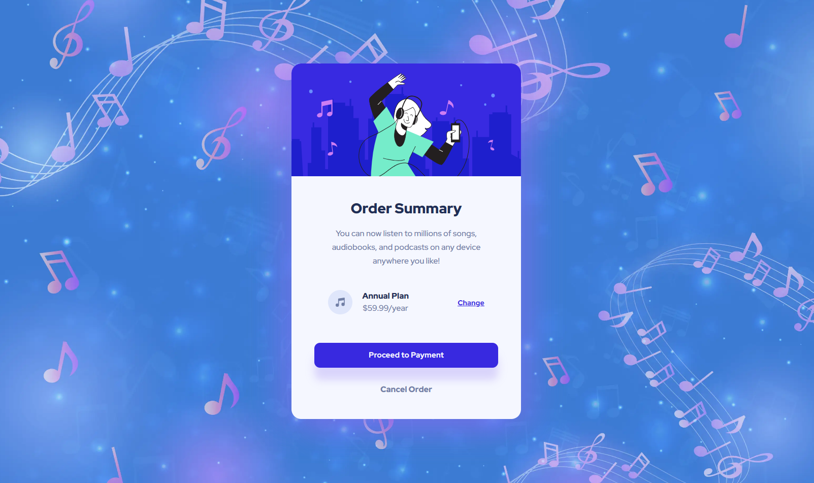

#Order summary card solution (html, scss)

## Table of contents

- [Overview](#overview)
  - [The challenge](#the-challenge)
  - [Links](#links)
- [My process](#my-process)
  - [Built with](#built-with)
  - [Continued development](#continued-development)
  - [Useful resources](#useful-resources)
- [Author](#author)

## Overview

### The challenge

Users should be able to:

- See hover states for interactive elements

### Links

- Solution URL: [Solution URL here](https://www.frontendmentor.io/solutions/streamlined-order-summary-with-html-and-scss-AiDn5T7lnN)
- Live Site URL: [Live site URL here](https://grimm-n.github.io/order-summary-component/)

## My process

### Built with

- HTML5
- SCSS
- Flexbox
- Flexbox
- Mobile-first workflow

### Continued development

My goal remains the same: to learn how to create perfectly mobile-adapted websites. I'm dedicated to mastering this skill.

### Useful resources

- [Freepick](https://www.freepik.com/) - I downloaded the backgroud image from this site.
- [A (more) Modern CSS Reset](https://piccalil.li/blog/a-more-modern-css-reset/) - Thanks again to Andy Bell for his wonderful cheat sheet! I'm using it, adapting it to my needs, and I highly recommend it to everyone.

## Author

- LinkedIn - [Natali Grimm](https://www.linkedin.com/in/grimm-n/)
- Frontend Mentor - [@Grimm-N](https://www.frontendmentor.io/profile/Grimm-N)
- Twitter - [@Grimm__N](https://x.com/Grimm__N)
